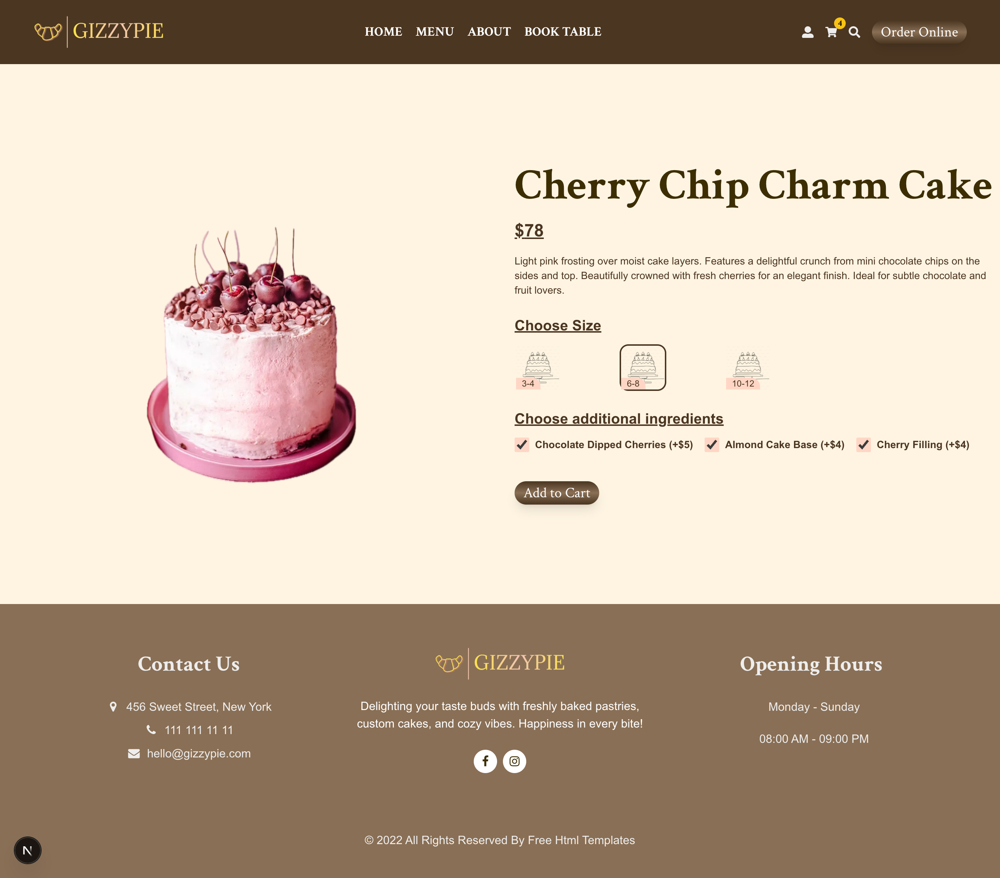
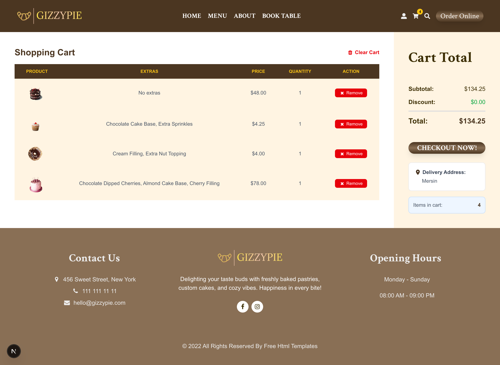
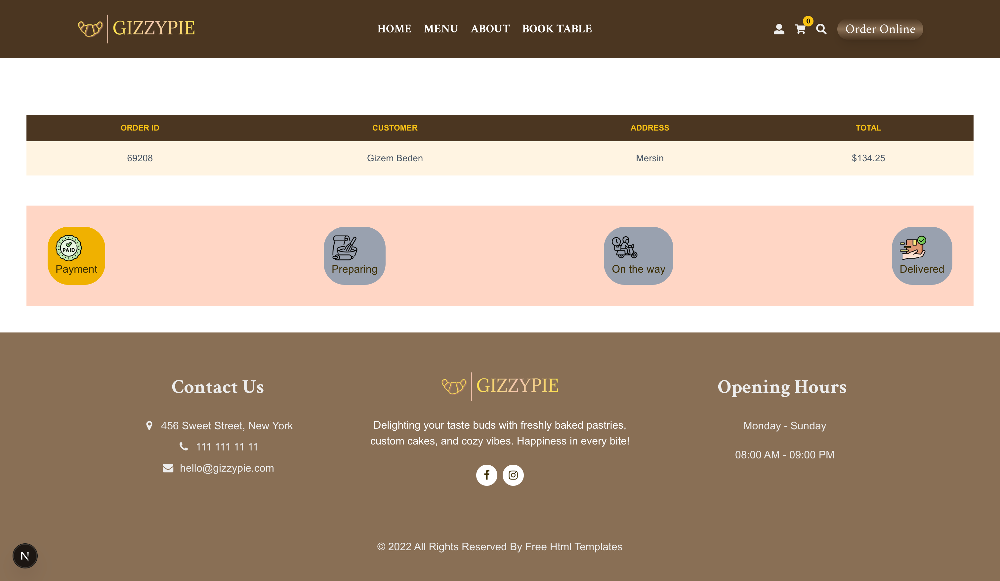
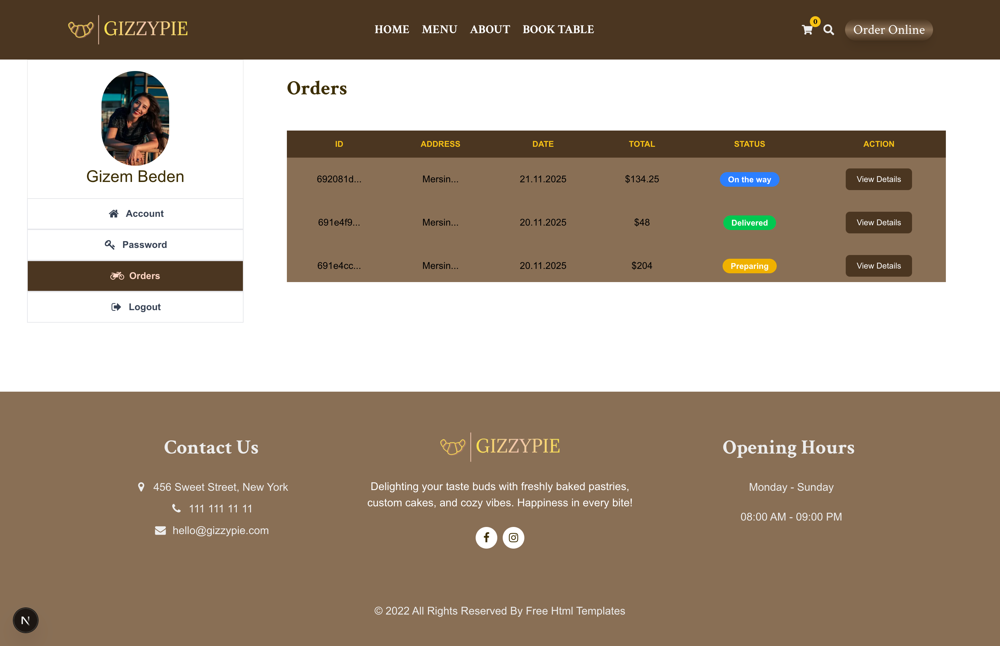
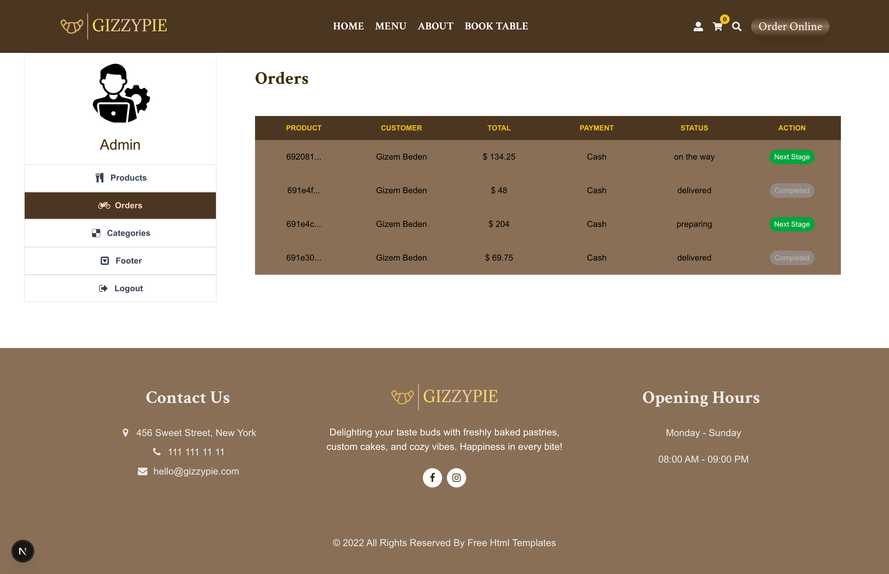

# 🍰 GizzyPie - Patisserie Ordering

A full-stack patisserie ordering application built with Next.js. Users can browse products, add items to the cart, place orders, track order status, and make table reservations. Includes an admin panel for managing products, categories, orders, and footer content.

## ✨ Features

### Customer Features

- 🛒 Browse products by category
- 🛍️ Add products to cart with extras
- 📦 Place and track orders
- 👤 User registration and login
- 📋 View order history
- 📅 Table reservation system
- ⚙️ Account management (profile update, password change, order history)

### Admin Features

- 📊 Admin dashboard
- 🍕 Add/Edit/Delete products
- 📁 Manage categories
- 📋 View and update order status
- 👥 Footer content management

## 🛠️ Tech Stack

**Frontend:**

- Next.js 15 (App Router)
- React 19
- Tailwind CSS 4
- Redux Toolkit (State Management)
- React Hook Form + Yup (Form Validation)
- Framer Motion (Animations)
- React Toastify (Notifications)
- Lottie React (Animations)

**Backend:**

- Next.js API Routes
- MongoDB + Mongoose
- NextAuth.js (Authentication)
- bcryptjs (Password Hashing)
- Axios (API requests)

## 🚀 Getting Started

### Prerequisites

- Node.js 18+
- MongoDB Atlas account or local MongoDB
- GitHub OAuth App (optional, for GitHub login)

### Installation

1. **Clone the repository**

```bash
   git clone https://github.com/gizemmb/nextjs-patisserie-ordering.git
   cd nextjs-patisserie-ordering
```

2. **Install dependencies**

```bash
   npm install
```

3. **Set up environment variables**

   Copy `.env.example` to `.env.local` and fill in your values:

```bash
   cp .env.example .env.local
```

4. **Run the development server**

```bash
   npm run dev
```

5. **Open your browser**

   Navigate to [http://localhost:3000](http://localhost:3000)

## 📁 Project Structure

```
gizzypie/
├── src/
│   ├── components/     # React components
│   ├── layout/         # Layout components
│   ├── lottie/         # Animation JSON files
│   ├── models/         # Mongoose models
│   ├── pages/          # Next.js pages & API routes
│   ├── redux/          # Redux store and slices
│   ├── schema/         # Yup validation schemas
│   ├── styles/         # TailwindCSS ve global CSS
│   └── util/           # Utility functions
├── public/             # Static assets
└── ...config files

```

## 🔐 Environment Variables

### Database
MONGODB_URI=mongodb+srv://your-connection-string

### GitHub OAuth (optional)
GITHUB_ID=your-github-client-id
GITHUB_SECRET=your-github-client-secret

### API URL
NEXT_PUBLIC_API_URL=http://localhost:3000/api

### Admin Credentials
ADMIN_USERNAME=admin
ADMIN_PASSWORD=your-admin-password
ADMIN_TOKEN=your-admin-token

### NextAuth (Required!)
NEXTAUTH_URL=http://localhost:3000
NEXTAUTH_SECRET=your-secret-key


## 🧪 API Testing

All backend API endpoints can be tested using Postman or any other API client.
Base URL for local development: http://localhost:3000/api
Base URL for production (Vercel): https://gizzypie.vercel.app/api
Example Endpoints:
GET /api/products – List all products
POST /api/orders – Create a new order
GET /api/users/:id – Get user info
You can also create a Postman collection for easier testing.

## 📸 Screenshots

### Home Page


### Product Detail Page



### Cart Page



### Order Page



### User Panel



### Admin Panel



## 🤝 Contributing

Contributions are welcome! Feel free to open an issue or submit a pull request.

## 📄 License

This project is open source and available under the [MIT License](LICENSE).

## 👩‍💻 Author

**Gizem Beden** - [GitHub Profile](https://github.com/gizemmb)

---

⭐ If you found this project helpful, please give it a star!
